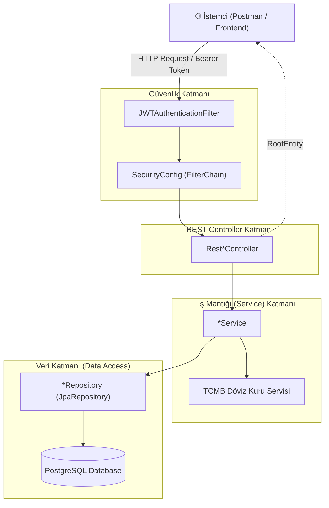
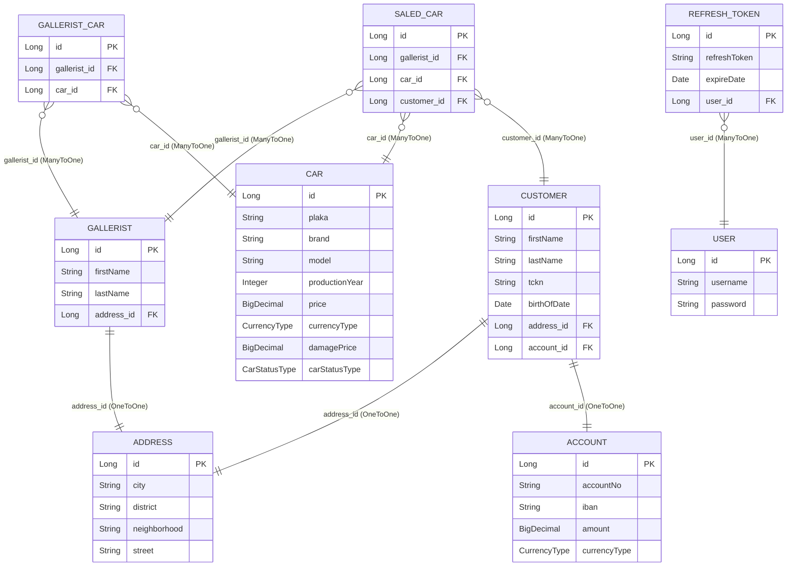
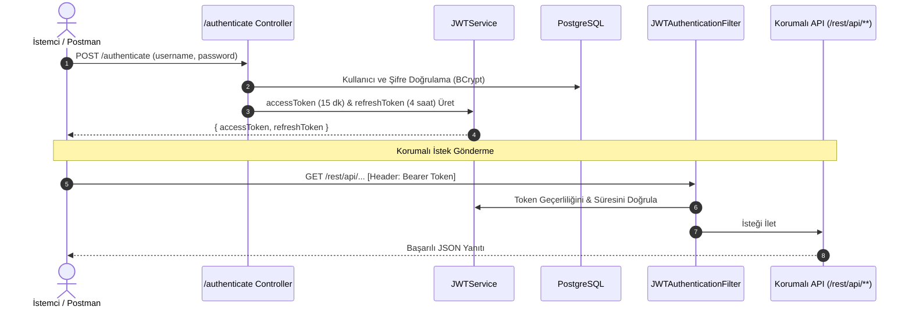
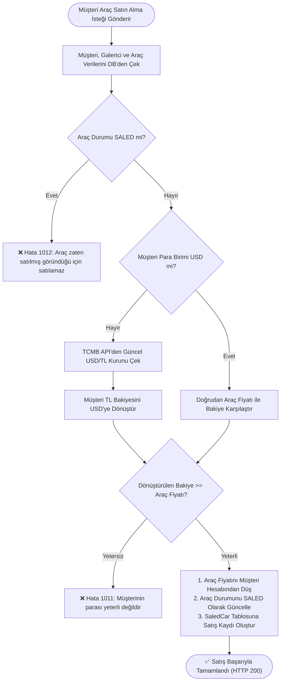

# 🚗 Gallerist - Oto Galeri Yönetim Sistemi & REST API

<div align="center">


<p align="center">
  <b>Gelişmiş Kur Entegrasyonlu, JWT Güvenlikli ve Katmanlı Mimarili Oto Galeri Yönetim Backend Sistemi</b>
  <br />
  <i>🎓 Staj Bitirme Projesi (Internship Capstone Project)</i>
</p>

</div>

---

## 📖 İçindekiler
- [📌 Proje Özeti](#-proje-özeti)
- [✨ Temel Özellikler](#-temel-özellikler)
- [🛠️ Teknoloji Yığını](#️-teknoloji-yığını)
- [🏗️ Sistem Mimarisi](#️-sistem-mimarisi)
- [📊 Veritabanı Modeli & ER Diyagramı](#-veritabanı-modeli--er-diyagramı)
- [🔐 Güvenlik & JWT Kimlik Doğrulama](#-güvenlik--jwt-kimlik-doğrulama)
- [💼 İş Mantığı & Satış Akışı (buyCar)](#-iş-mantığı--satış-akışı-buycar)
- [📋 REST API Uç Noktaları](#-rest-api-uç-noktaları)
- [⚠️ Hata Yönetimi & Hata Kodları](#️-hata-yönetimi--hata-kodları)
- [📂 Proje Dizin Yapısı](#-proje-dizin-yapısı)
- [🚀 Kurulum ve Çalıştırma](#-kurulum-ve-çalıştırma)
- [👤 Geliştirici & Lisans](#-geliştirici--lisans)

---

## 📌 Proje Özeti

**Gallerist**, otomobil galerilerinin araç stoklarını, galerici bilgilerini, müşteri profillerini ve finansal hesaplarını tek bir çatı altında yöneten **Spring Boot** tabanlı kurumsal bir REST API backend projesidir.

Sistem; araçların galerilerle eşleştirilmesi, müşteri bakiye yönetimi, **TCMB (Türkiye Cumhuriyet Merkez Bankası)** üzerinden anlık döviz kurlarının çekilmesi ve çoklu para birimi (TL/USD) dönüşümüyle araç satın alma süreçlerini otomatik olarak yönetir.

---

## ✨ Temel Özellikler

- 🔒 **JWT & Spring Security Tabanlı Kimlik Doğrulama**: Access token ve Refresh token mimarisi ile uçtan uca güvenli oturum yönetimi.
- 💱 **TCMB Canlı Döviz Kuru Entegrasyonu**: Satış işlemlerinde müşterinin TL bakiyesi anlık kura göre USD'ye çevrilerek dinamik bakiye kontrolü sağlanır.
- 🚘 **Araç & Galeri Portföy Yönetimi**: Galerici-Araç ilişkilendirmeleri (Unique constraint ile mükerrer kayıt engelleme), araç hasar kaydı ve durum takibi (`SALABLE` / `SALED`).
- 💳 **Hesap & Bakiye Yönetimi**: Müşteri banka hesapları, IBAN formatı ve çoklu para birimi desteği.
- 🎯 **Merkezi Standart Yanıt Yapısı (`RootEntity<T>`)**: Tüm başarılı ve hatalı HTTP isteklerinde tutarlı JSON yanıt formatı.
- 🛡️ **Global Exception Handler**: Hata kodları (`1004`, `1011`, vb.) ile istemciye anlaşılır hata mesajları dönen merkezi istisna yönetimi.

---

## 🛠️ Teknoloji Yığını

| Katman / Kütüphane | Teknoloji | Açıklama |
|---|---|---|
| **Dil** | Java 17 (LTS) | Modern Java sözdizimi ve özellikleri |
| **Framework** | Spring Boot 3.3.4 | Bağımlılık yönetimi ve mikroservis altyapısı |
| **Güvenlik** | Spring Security & JJWT 0.11.5 | Stateless JWT & Refresh Token doğrulaması |
| **Veritabanı** | PostgreSQL | İlişkisel veritabanı (`schema: gallerist`) |
| **ORM / Veri Erişimi** | Spring Data JPA / Hibernate | Nesne-İlişkisel eşleme (`ddl-auto=validate`) |
| **Veritabanı Göçü** | Liquibase | Şema yönetimi ve versiyonlama |
| **Validasyon** | Hibernate Validator | `@Valid`, `@NotNull`, `@NotBlank` doğrulamaları |
| **Yardımcı Araçlar** | Lombok | `@Getter`, `@Setter`, `@Builder`, `@NoArgsConstructor` |
| **Derleme & Paketleme**| Apache Maven 3.8+ | Proje yaşam döngüsü ve bağımlılık yönetimi |

---

## 🏗️ Sistem Mimarisi

Proje **Katmanlı Mimari (Layered Architecture)** ve **Interface - Implementation** tasarım deseni prensipleri doğrultusunda geliştirilmiştir:



### Standart API Yanıt Formatı (`RootEntity<T>`)

**Başarılı İstek (HTTP 200):**
```json
{
  "status": 200,
  "payload": {
    "id": 1,
    "firstName": "Ahmet",
    "lastName": "Yılmaz"
  },
  "errorMessage": null
}
```

**Hatalı İstek (HTTP 500 / 400):**
```json
{
  "status": 500,
  "payload": null,
  "errorMessage": "müşterinin parası yeterli değildir"
}
```

---

## 📊 Veritabanı Modeli & ER Diyagramı

Veritabanı ilişkileri, tablolar, primary key (PK) ve foreign key (FK) alanları aşağıda modellenmiştir:



### Enum Tanımları
| Enum | Değerler | Açıklama |
|---|---|---|
| `CurrencyType` | `TL`, `USD` | Desteklenen para birimleri |
| `CarStatusType` | `SALABLE`, `SALED` | Araç satış durumu (Satılabilir / Satıldı) |

---

## 🔐 Güvenlik & JWT Kimlik Doğrulama

Sistem **Spring Security Filter Chain** ve **Stateless JWT** mimarisi ile korunmaktadır:



- **Açık Uç Noktalar (Token Gerekmez)**: `/register`, `/authenticate`, `/refreshToken`
- **Korumalı Uç Noktalar (Bearer Token Gerekir)**: `/rest/api/**` altındaki tüm işlemler

---

## 💼 İş Mantığı & Satış Akışı (`buyCar`)

Sistemin en kritik iş kuralı olan `buyCar` (`/rest/api/saled-car/save`) endpoint akışı:



---

## 📋 REST API Uç Noktaları

### 📌 Endpoint Özet Tablosu

| # | HTTP Method | Endpoint URL | Auth | Açıklama |
|---|---|---|---|---|
| 1 | `POST` | `/register` | ❌ Public | Yeni kullanıcı kaydı oluşturur |
| 2 | `POST` | `/authenticate` | ❌ Public | Giriş yapar ve JWT token çifti döner |
| 3 | `POST` | `/refreshToken` | ❌ Public | Süresi dolan token'ı yeniler |
| 4 | `POST` | `/rest/api/address/save` | 🔒 Bearer | Yeni adres kaydı oluşturur |
| 5 | `POST` | `/rest/api/account/save` | 🔒 Bearer | Müşteri banka hesabı oluşturur |
| 6 | `POST` | `/rest/api/gallerist/save` | 🔒 Bearer | Galerici kaydı oluşturur |
| 7 | `POST` | `/rest/api/car/save` | 🔒 Bearer | Yeni araç stoğu ekler |
| 8 | `POST` | `/rest/api/customer/save` | 🔒 Bearer | Yeni müşteri profili oluşturur |
| 9 | `POST` | `/rest/api/gallerist-car/save`| 🔒 Bearer | Galeri ile araç eşleştirmesi yapar |
| 10| `POST` | `/rest/api/saled-car/save` | 🔒 Bearer | ⭐ Araç satın alma işlemini yürütür |
| 11| `GET`  | `/rest/api/currency-rates` | 🔒 Bearer | TCMB USD/TL kurlarını sorgular |

---

### 🔍 Detaylı İstek & Yanıt Örnekleri

#### 1️⃣ Kullanıcı Kaydı (`/register`)
- **Method**: `POST`
- **URL**: `http://localhost:8080/register`
- **Request Body:**
```json
{
  "username": "omer",
  "password": "password123"
}
```

#### 2️⃣ Giriş Yap & Token Al (`/authenticate`)
- **Method**: `POST`
- **URL**: `http://localhost:8080/authenticate`
- **Request Body:**
```json
{
  "username": "omer",
  "password": "password123"
}
```
- **Response:**
```json
{
  "status": 200,
  "payload": {
    "accessToken": "eyJhbGciOiJIUzI1NiJ9...",
    "refreshToken": "7c4a1e9e-648b-4b13-9799-a681d4bf4b8c"
  },
  "errorMessage": null
}
```

#### 3️⃣ Araç Kaydet (`/rest/api/car/save`)
- **Method**: `POST`
- **URL**: `http://localhost:8080/rest/api/car/save`
- **Header**: `Authorization: Bearer <accessToken>`
- **Request Body:**
```json
{
  "plaka": "34ABC123",
  "brand": "BMW",
  "model": "320i",
  "productionYear": 2023,
  "price": 35000.00,
  "currencyType": "USD",
  "damagePrice": 0.00,
  "carStatusType": "SALABLE"
}
```

#### 4️⃣ Araç Satın Al (`/rest/api/saled-car/save`)
- **Method**: `POST`
- **URL**: `http://localhost:8080/rest/api/saled-car/save`
- **Header**: `Authorization: Bearer <accessToken>`
- **Request Body:**
```json
{
  "customerId": 1,
  "galleristId": 1,
  "carId": 1
}
```

---

## ⚠️ Hata Yönetimi & Hata Kodları

Sistem genelinde fırlatılan tüm istisnalar `GlobalExceptionHandler` tarafından yakalanır ve aşağıdaki hata kodlarıyla `RootEntity` içerisinde sunulur:

| Hata Kodu | Hata Mesajı | Açıklama |
|---|---|---|
| **1004** | `kayıt bulunamadı` | İstenen ID'ye ait entity veritabanında mevcut değil |
| **1005** | `tokenın süresi bitmiştir` | JWT Access token süresi dolmuş |
| **1006** | `username bulunamadı` | Kimlik doğrulamada kullanıcı mevcut değil |
| **1007** | `kullanıcı adı veya şifre hatalı` | Hatalı kullanıcı adı veya parola |
| **1008** | `refresh token bulunamadı` | Geçersiz Refresh Token |
| **1009** | `refresh tokenın süresi bitmiştir` | Refresh Token süresi dolmuş |
| **1010** | `döviz kuru alınamadı` | TCMB API bağlantı/veri ayrıştırma hatası |
| **1011** | `müşterinin parası yeterli değildir` | Müşteri bakiyesi araç bedelini karşılamıyor |
| **1012** | `araba satılmış göründüğü için satılamaz` | Durumu `SALED` olan aracın tekrar satışı engellendi |
| **9999** | `genel bir hata oluştu` | Yakalanmayan beklenmedik sunucu hataları |

---

## 📂 Proje Dizin Yapısı

```
com.omersemizoglu
├── config/              # Uygulama ve Spring Security yapılandırmaları
├── controller/          # REST API Sınıfları
├── dto/                 # İstek (IU) ve Yanıt DTO sınıfları (auth alt paketi dahil)
├── enums/               # CarStatusType, CurrencyType enum tanımları
├── exception/           # Özel istisnalar, ErrorMessage ve MessageType
├── handler/             # GlobalExceptionHandler, AuthEntryPoint
├── jwt/                 # JWTService, JWTAuthenticationFilter
├── model/               # JPA Entity'leri (BaseEntity kalıtımlı)
├── repository/          # Spring Data JpaRepository arayüzleri
├── service/             # İş kuralları servisleri
├── starter/             # Spring Boot Main Sınıfı (GalleristApplicationStarter)
└── utils/               # Tarih ve yardımcı araç sınıfları (DateUtils)
```

---

## 🚀 Kurulum ve Çalıştırma

### 1. Önkoşullar
- **Java Development Kit (JDK)** 17 veya üzeri
- **PostgreSQL Database** 14+
- **Maven** 3.8+ (veya proje içindeki `mvnw` wrapper)

### 2. Veritabanı Hazırlığı
PostgreSQL'de bir veritabanı ve `gallerist` şemasını oluşturun:
```sql
CREATE DATABASE postgres;
\c postgres;
CREATE SCHEMA IF NOT EXISTS gallerist;
```

### 3. Yapılandırma (`application.properties`)
`src/main/resources/application.properties` dosyasındaki veritabanı ve JWT ayarlarını kontrol edin:
```properties
spring.application.name=gallerist
spring.datasource.url=jdbc:postgresql://localhost:5432/postgres
spring.jpa.properties.hibernate.default_schema=gallerist
spring.datasource.username=postgres
spring.datasource.password=your_postgres_password

spring.jpa.hibernate.ddl-auto=validate
spring.jpa.show-sql=true
spring.jpa.properties.hibernate.format_sql=true

# Liquibase
spring.liquibase.change-log=classpath:db/changelog/db.changelog-master.xml
spring.liquibase.default-schema=gallerist

jwt.secret-key=JfVoLB61pmyKbWswGsuxD6TMnPFZzsoOACmSd1mA5hM=
```

### 4. Uygulamayı Derleme & Başlatma
```bash
# Proje kök dizininde:
./mvnw clean install

# Uygulamayı başlat:
./mvnw spring-boot:run
```
Uygulama varsayılan olarak **`http://localhost:8080`** portunda çalışacaktır.

---

## 👤 Geliştirici & Lisans

- **Geliştirici:** Ömer Semizoğlu
- **Proje Türü:** Staj Bitirme Çalışması / Capstone Project
